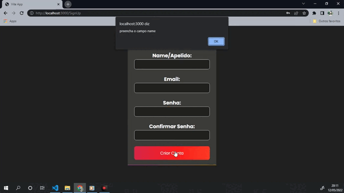
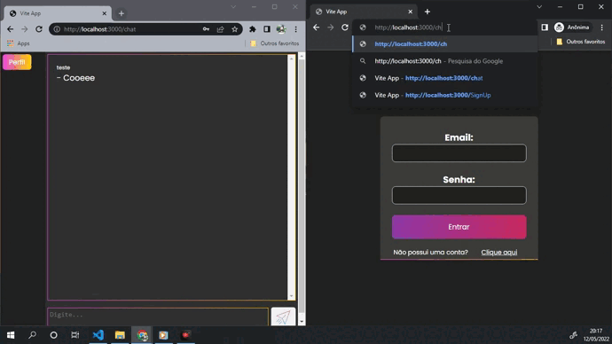

<h1 align="center">
  Chat
</h1>

<p align="center">
 

  
</p>

## Tecnologias

- ReactJS
- Vite
- Styled-components
- Typescript
- NodeJS
- Prisma
- Express
- Sqlite
- Axios
- Socket.io

</br>

### Como rodar o projeto

```bash
# Clone este repositório
$ git clone <https://github.com/Maria-Eduarda90/chat>

# Acesse a pasta do projeto no terminal/cmd
$ cd chat

# 🎲 Rodando o FrontEnd
$ cd frontend

# Instale as dependências
$ yarn install

# Execute a aplicação em modo de desenvolvimento
$ yarn dev

# 🎲 Rodando o BackEnd (servidor)
$ cd backend

# Instale as dependências
$ yarn install

# Execute a aplicação em modo de desenvolvimento
$ yarn dev

```

</br>

<h1 align="center"> 
	Projeto 
</h1>

<h1 align="center">
  
</h1>
<h1 align="center">
  
</h1>
